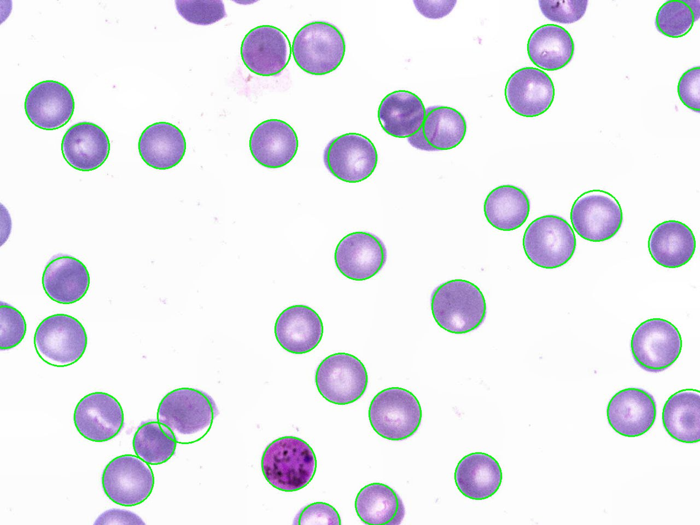
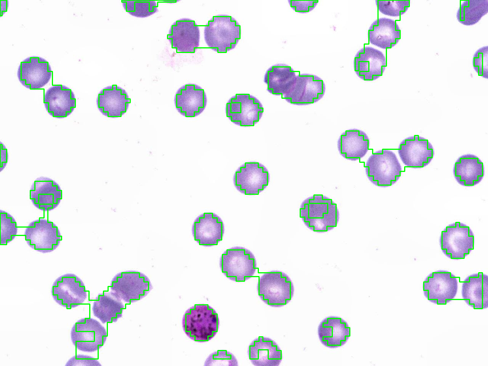
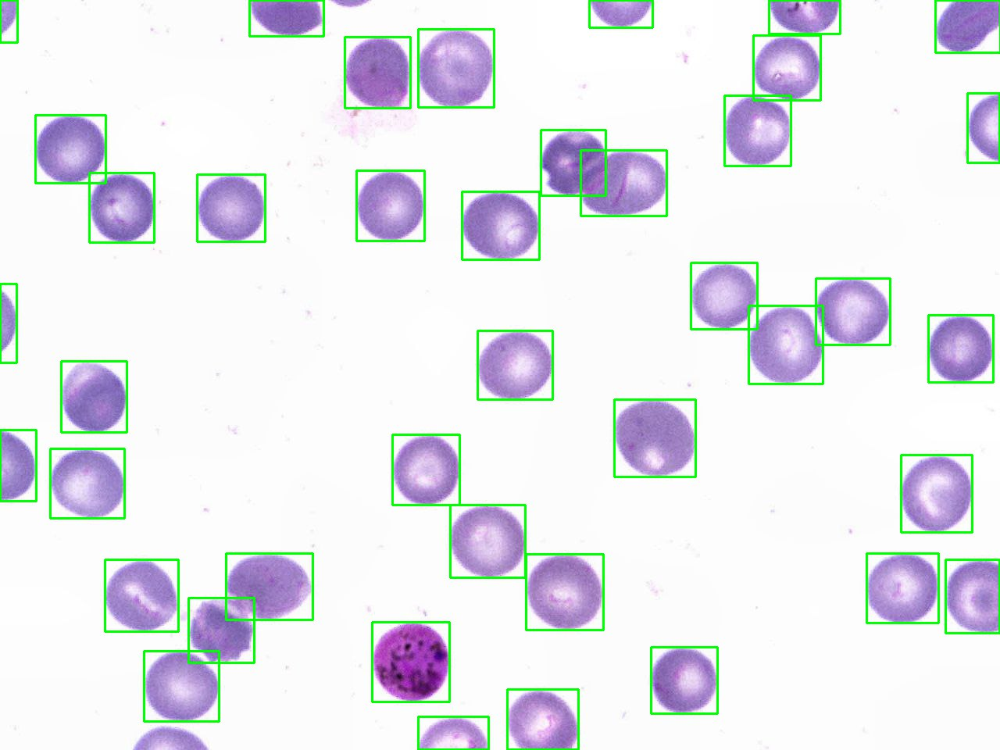
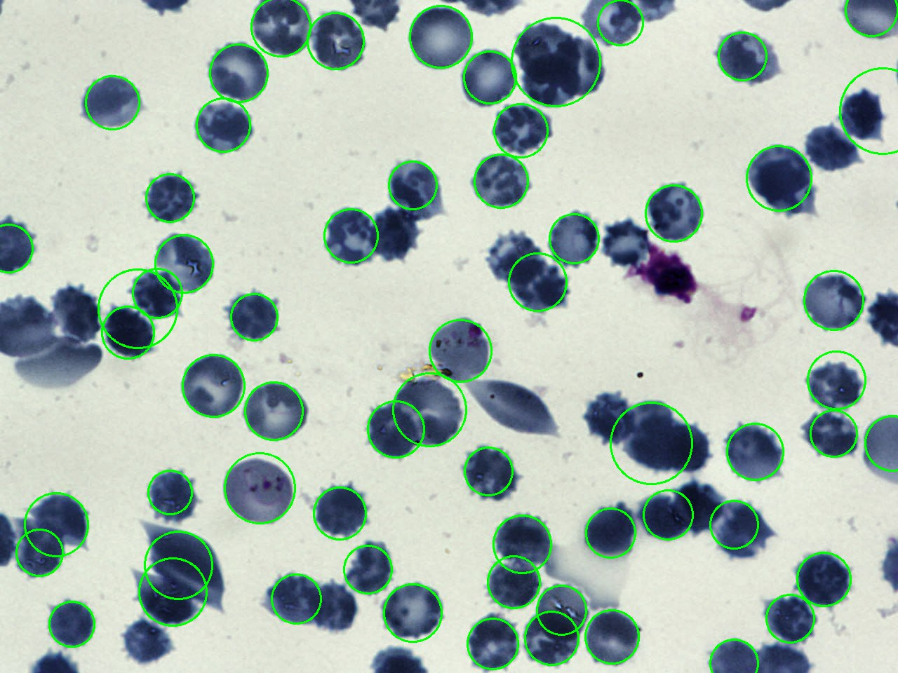
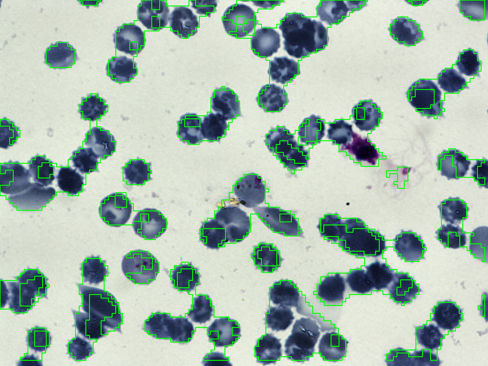
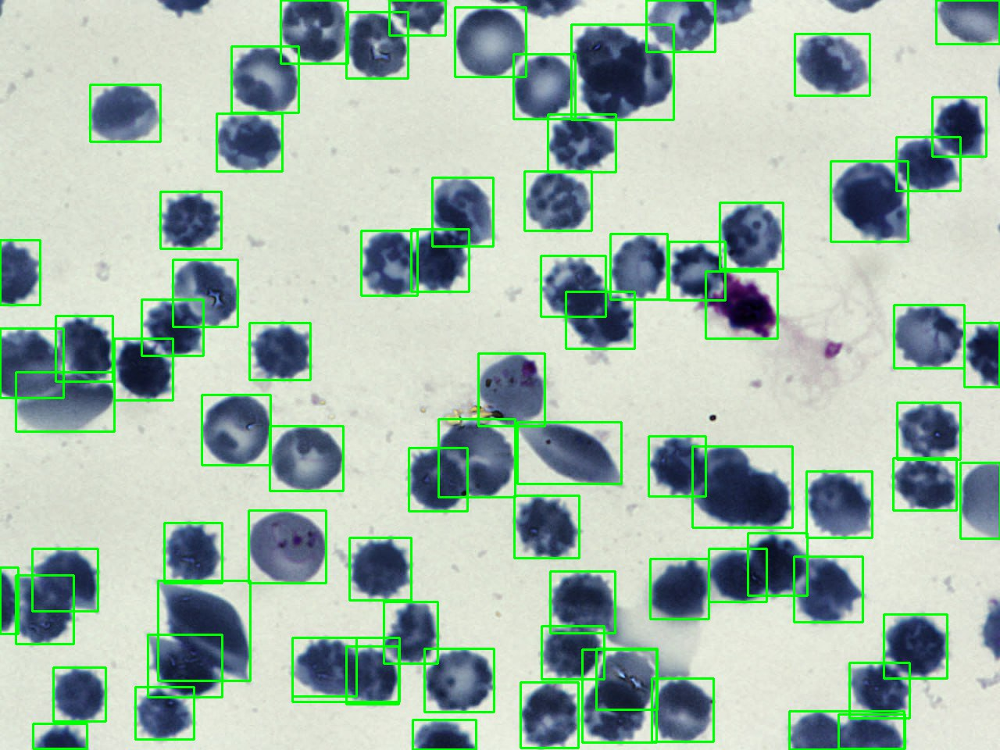

# computer_vision_tg_bot

# Функционал
Телеграм бот позволяет автоматизировать подсчет количества клеток по данным оптической микроскопии.

Подсчет количества клеток осуществляется тремя алгоритмами:
- классическая обработка изображений (препроцессинг изображения с последующим поиском круглых контуров градиентным методом Хафа);
- алгоритм, основанный на явном преобразовании участков изображений в облако точек (контраст, энергия, однородность, корреляция) с последующей кластеризацией при помощи KMeans на два кластера;
- сверточная нейронная сеть YOLOv8 (подробнее yolov8/README.md).

Результаты вычислений сохраняются в локальную БД с возможностью дальнейшей выгрузки в табличном виде.

# Ключевые места в структуре проекта
```
COMPUTER_VISION_TG_BOT
│   main.py # Запуск приложения 
│
└───database # База данных
│   
└───datasets # Наборы сгенерированных и реальных изображений
│
└───tg_bot # Логика телеграм бота
│   └───routers
│       └───analysis_methods
│       │   └───backend # Методы анализа изображений
│       │       └───cv_analysis_method
│       │       └───cnn_analysis_method
│       │       └───ml_analysis_method
│       │
│       └───generate_data
│       │   └───beckend # Генерация изображений
│       │
│       └───experiment_report
│           └───backend # Формирование отчета экспериментов
│
└───utils # Скрипты разметки и аугментации датасетов
│
└───yolov8 # Скрипты обучения CNN модели
```

# Команда
- Ячменьков Алекскей Дмитриевич
    - Разработка телеграм бота
    - Разработка базы данных
    - Разработка генератора изображений
    - Разработка CV метода обработки изображений
- Аллабердин Богдан Ильдарович
    - Разработка генератора изображений
    - Разработка CNN метода обработки изображений
    - Разработка ML метода обработки изображений

# Результаты
Результаты оценивались на изображениях размером 1984 x 1408 (изображения чуть меньшего размера расширялись рамками)
- средняя ошибка cv метода составила порядка 9 клеток
- средняя ошибка мл метода - ---
- средняя ошибка yolo - 4 клетки

| cv | ml | cnn |
|:-------------------------:|:-------------------------:|:-------------------------:|
| |  ||
|  |  ||


**Важно. К сожалению, метод мл выдает крайне низкую точность. Кроме того его время работы кратно возрастает при уменьшении участка анализа. Ввиду этого в телеграм боте используется версия с большим окном, что делает этот метод мало эффективным**