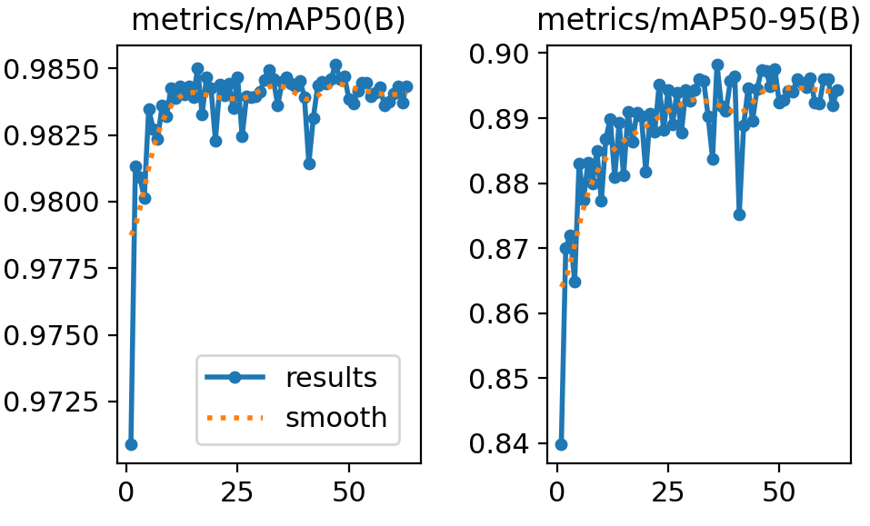

#### Note
Для работы YOLO требуется установить Ultralytics: pip install ultralytics

## Подготовка данных
Предварительно был создан датасет с синтетическими данными. Изображения содержали по 10, 20, 30, 40, 50, 60, 70, 80, 90, и 100 клеток. Часть изображений датасета дополнительно размывалась и зашумлялась.
Для разметки реальных данных по маскам был написан скрипт utils/mark_up_dataset.py

## Модель
Для проекта была выбрана YOLOv8 nano

## Обучение
Обучение происходило в 2 этапа:
- **1 этап** | обучение уже предобученной yolov8n на сгенерированном датасете (train ~ 3900 изображений, val - ~1300) на 10 эпохах

- **2 этап** | обучение на реальном датасете на 63 эпохах 

## Изображения
Предварительно ко всем изображениям был добавлен паддинг, чтобы итоговые размеры были равны 1984x1408

## Результаты
На тестовой части датасета BCCD_Dataset_with_mask средняя ошибка модели составила 4 клетки

---

##### P.S.
Результаты обучения можно посмотреть через tensorboard
tensorboard --logdir yolov8/tensorboard_runs